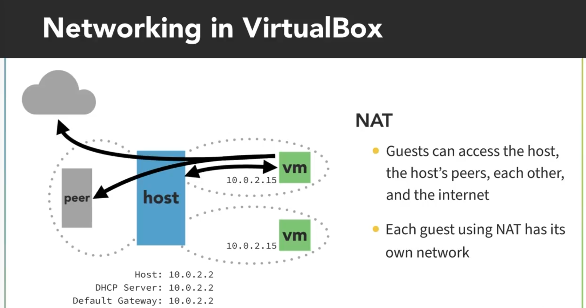
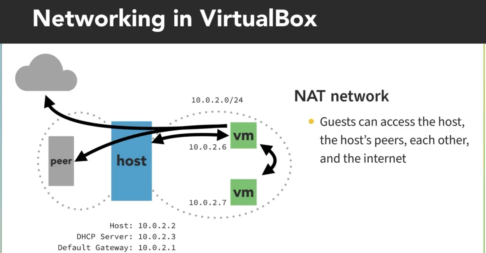
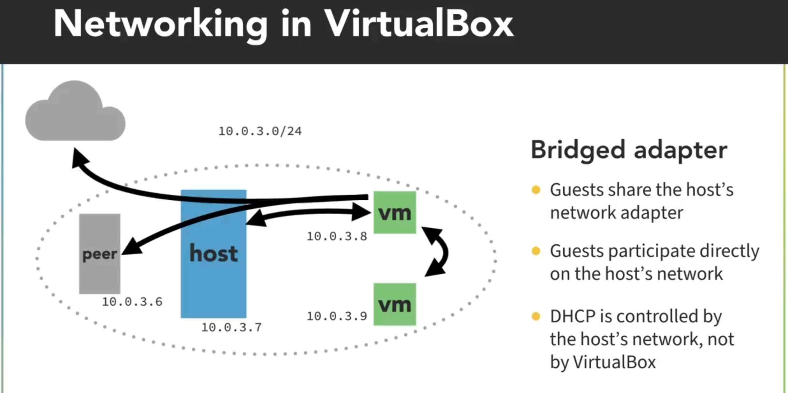
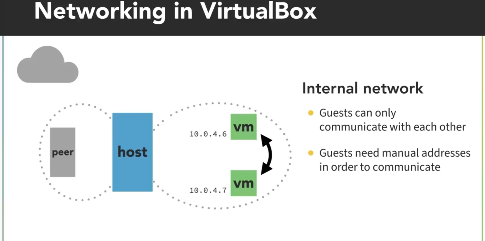
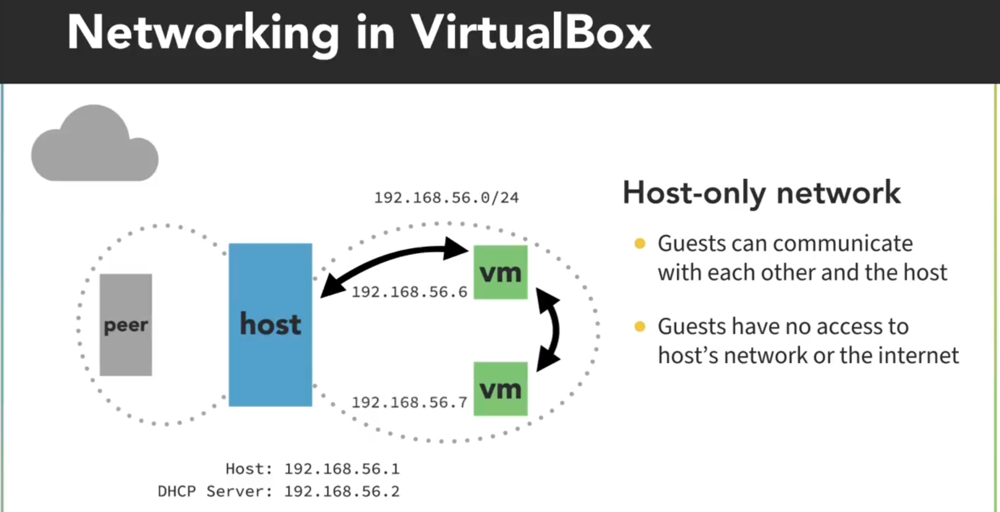

# Redes en VirtualBox

**RECORDATORIO**:

- Rangos Private Network Class A: `10.0.0.0` a `10.255.255.255`.
- Rangos Private Network Class C: `192.168.0.0` a `192.168.255.255`.
- Por defecto VirtualBox asigna unha dirección `10.0.2.0/24` en modo NAT.
- Por defecto VirtualBox asigna unha dirección `192.168.56.0/24` en modo Host-only Network.
- Podemos mixturar os modos, creando interfaces virutais diferentes.

## 1. Modo NAT (modo por defecto)

> _Cada VM ten a súa propia rede co anfitrión (host)._

> _A onde pode acceder a VM?_

- Ao anfitrión (_host_).
- Ás maquinas que estean na rede do anfitrión (_host_) como por exemplo a máquina chamada _peer_.
- A internet.

> _A onde **NON** pode acceder a VM?_

- A outras VMs. Por defecto cada VM en modo NAT leva asociada **unha rede propia por defecto**.

> _Quen pode acceder á VM?_

- Únicamente o anfitrión (_host_).

> _Quen **NON** pode acceder á VM?_

- Outras VMs.
- Outros equipos da rede do anfitrión (_host_) coma _peer_.
- Equipos dende Internet.

> _Entón, o acceso á VM está "capado"?_

- Non exactamente. Podemos usar Port Forwarding no anfitrión (_host_).

## 2. Modo NAT Network

> _As VMs comparten rede entre elas e co anfitrión (host): poden interactuar entre elas._

> _As VMs comparten rede e poden interactuar entre elas_

O resto coincide co modo anterior (NAT). Se queremos permitir conexións entrantes dende o exterior, teríamos que usar usar Port Forwarding no anfitrión (_host_) (igual que no modo anterior).

> _Teño que facer algo "extra"?_

Si. Antes hai que crear a rede NAT antes na configuración de VirtualBox:

- Proporcionará un rango de direccións
- Habilitará (ou non) o servidor DHCP.

## 3. Modo Bridged Adapter

> _As VMs forman parte da rede do anfitrión (host): poden interactuar con calquera membro desa rede._

👁 **Ollo** 👁, o anfitrión (_host_) controla o servidor DHCP, non VirtualBox. Xa non temos que usar Port Forwarding.

## 4. Modo Internal Network

> _As VMs comparten rede entre elas **pero non** co anfitrión (host)._

- A dirección de rede debe ser configurada manualmente en cada VM (como fariamos nunha rede sen servidor DHCP).

## 5. Host-only Network

> _As VMs comparten rede entre elas e co anfitrión (host) **pero non** poden ir mais aló._

- Volvemos ter un servidor DHCP.
- Podemos ter máis de unha rede Host-only.
